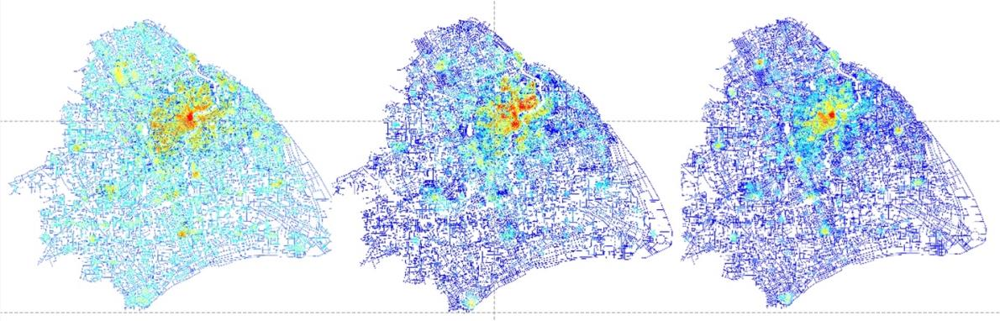

<p align="center">
  
</p>

<h1 align="center">UrConnect</h1>

<p align="center">
  Spatial configuration analysis for urban street networks, based on depthmapX and extended with reach, directional distance, weighted accessibility, and path-analysis workflows.
</p>

<p align="center">
  <a href="https://github.com/intelligibleCityLab/UrConnect/actions/workflows/docs.yml"></a>
  <a href="LICENSE"></a>
  
  
  
</p>

<p align="center">
  <a href="https://intelligiblecitylab.github.io/UrConnect/en/installation.html">Installation</a> |
  <a href="https://intelligiblecitylab.github.io/UrConnect/en/getting-started.html">Getting Started</a> |
  <a href="https://intelligiblecitylab.github.io/UrConnect/en/analysis-reach.html">User Guide</a> |
  <a href="README.zh-CN.md">简体中文</a> |
  <a href="README.zh-TW.md">繁體中文</a>
</p>

## Overview

UrConnect is a standalone desktop tool for segment-based urban street-network analysis. It combines topological and metric distance concepts with street attributes such as length, population, POI counts, floor area, or other GIS variables.

The software supports workflows for:

- metric, directional, junction, and combined reach analysis
- interactive reach from selected source segments
- directional and junction distance analysis
- point distance analysis
- shortest-path simulation with manual OD input or OD matrix files
- visualization, screen export, attribute export, and Shapefile outputs

## Documentation

The documentation is built as Sphinx HTML pages with a left navigation, page table of contents, searchable pages, and three language sections:

- [English documentation](https://intelligiblecitylab.github.io/UrConnect/en/installation.html)
- [简体中文文档](https://intelligiblecitylab.github.io/UrConnect/zh-CN/installation.html)
- [繁體中文文件](https://intelligiblecitylab.github.io/UrConnect/zh-TW/installation.html)

## Installation

Download the package for your operating system from [GitHub Releases](https://github.com/intelligibleCityLab/UrConnect/releases). Windows is the primary v0.1.0 release target. macOS and Linux packages are provided as experimental builds while cross-platform validation continues.

Build from source:

```bash
cmake -S . -B build -DQT5_ROOT=/path/to/Qt/5.15 -DBOOST_ROOT=/path/to/boost
cmake --build build --config Release
```

See the [Installation guide](https://intelligiblecitylab.github.io/UrConnect/en/installation.html) for platform-specific commands.

## Repository Layout

```text
.
├── depthmapX/        Qt desktop application, views, dialogs, resources, and UI files
├── salalib/          Core spatial analysis algorithms and graph/map data structures
├── genlib/           Shared geometry, math, parsing, and utility code
├── mgraph440/        Legacy graph-analysis code retained for compatibility
├── SNDAApp/          UrbanConnect analysis code and bundled Shapelib sources
├── docs/             Sphinx documentation in English, Simplified Chinese, Traditional Chinese
└── .github/          Issue templates and GitHub Actions workflows
```

## Citation

If you use UrConnect in academic work, please cite the project. See [CITATION.cff](CITATION.cff). The citation metadata should be updated with publication details before the repository is made public.

## License

UrConnect is licensed under the GNU General Public License v3.0 or later. Third-party component notices are listed in [THIRD_PARTY_NOTICES.md](THIRD_PARTY_NOTICES.md).

## Acknowledgements

UrConnect builds on depthmapX, sala, genlib, and Shapelib. We thank the original contributors and the research collaborators from Shenzhen University and Georgia Institute of Technology who developed the UrbanConnect methods.
