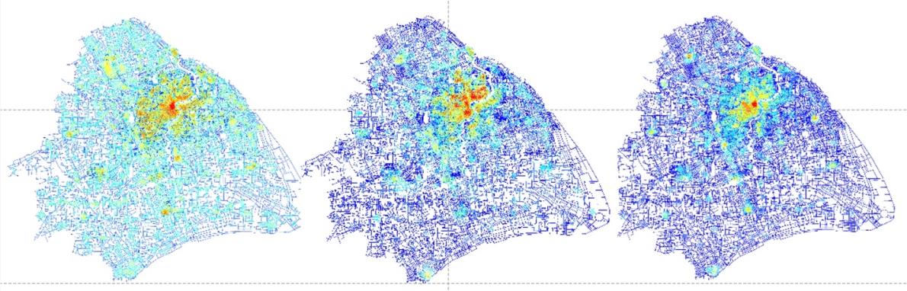

<p align="center">
  
</p>

<h1 align="center">UrConnect</h1>

<p align="center">
  An innovative spatial configuration analysis tool for segment-based urban street networks, introducing UrConnect algorithms for reach, directional distance, weighted accessibility, and path analysis.
</p>

<p align="center">
  <a href="https://github.com/intelligibleCityLab/UrConnect/actions/workflows/docs.yml"></a>
  <a href="LICENSE"></a>
  
  
  
</p>

<p align="center">
  <a href="https://intelligiblecitylab.github.io/UrConnect/en/installation.html">Installation</a> |
  <a href="https://intelligiblecitylab.github.io/UrConnect/en/getting-started.html">Getting Started</a> |
  <a href="https://intelligiblecitylab.github.io/UrConnect/en/analysis-reach.html">User Guide</a> |
  <a href="README.zh-CN.md">简体中文</a> |
  <a href="README.zh-TW.md">繁體中文</a>
</p>

## Overview

UrConnect is a standalone desktop tool for segment-based urban street-network analysis. It combines topological and metric distance concepts with street attributes such as length, population, POI counts, floor area, or other GIS variables.

The software supports workflows for:

- metric, directional, junction, and combined reach analysis
- interactive reach from selected source segments
- directional and junction distance analysis
- point distance analysis
- shortest-path simulation with manual OD input or OD matrix files
- visualization, screen export, attribute export, and Shapefile outputs

## Documentation

The documentation is built as Sphinx HTML pages with a left navigation, page table of contents, searchable pages, and three language sections:

- [English documentation](https://intelligiblecitylab.github.io/UrConnect/en/installation.html)
- [简体中文文档](https://intelligiblecitylab.github.io/UrConnect/zh-CN/installation.html)
- [繁體中文文件](https://intelligiblecitylab.github.io/UrConnect/zh-TW/installation.html)

## Installation

The source version is 0.2.0. Check [GitHub Releases](https://github.com/intelligibleCityLab/UrConnect/releases) for published packages. The existing standalone Windows desktop application remains in the v0.1.0 release; it is not relabelled as 0.2.0. macOS and Linux packages remain experimental while cross-platform validation continues.

Build from source:

```bash
cmake -S . -B build -DQT5_ROOT=/path/to/Qt/5.15 -DBOOST_ROOT=/path/to/boost
cmake --build build --config Release
```

See the [Installation guide](https://intelligiblecitylab.github.io/UrConnect/en/installation.html) for platform-specific commands.

## Command-line interface

In addition to the desktop application, the build produces `urconnect-cli`, a headless command-line front end for the analysis engine (no Qt or display required), suitable for batch and reproducible pipelines:

```bash
# Metric reach at 400 m and 800 m radii; appends R400/R800 columns to the input .dbf
urconnect-cli reach network.shp --radius 400,800

# Directional reach: 45-degree turn angle, up to 0/1/2 directional changes
urconnect-cli dr network.shp --angle 45 --turns 0,1,2

# Directional distance, mixed reach, junction reach/distance
urconnect-cli ddl network.shp --radius 400,800 --angle 45
urconnect-cli mdr network.shp --radius 800 --angle 45 --turns 1,2
urconnect-cli jnr network.shp --junction-degree 3 --junction-limit 2,3
urconnect-cli jnd network.shp --radius 800 --junction-degree 3

# Reachable subset / step depth from given origin road(s)
urconnect-cli netreach network.shp --from 10 --radius 400
urconnect-cli stepdepth network.shp --from 10 --type dr --angle 45

# OD shortest paths: single pair, or a batch CSV with origin,destination columns
urconnect-cli od network.shp --from 10 --to 500
urconnect-cli od network.shp --pairs pairs.csv
```

Run `urconnect-cli --help` for the full option list. Whole-network results are appended as attribute columns to the input `.dbf` (same field names as the GUI); `netreach` and `od` write route shapefiles next to the input; `od --pairs` additionally writes a result CSV (`<pairs>_MR.csv`).

For a CLI-only build without Qt:

```bash
cmake -S . -B build -DURCONNECT_BUILD_GUI=OFF -DBOOST_ROOT=/path/to/boost
cmake --build build --config Release --target urconnect-cli
```

For v0.2.0, the release workflow packages the standalone `urconnect-cli` executable with the macOS and Linux applications and produces a separate `urconnect-cli-windows-x64.exe` asset for Windows. The CLI statically links the bundled Shapelib implementation and does not require Qt or a display server.

## Tests

The CTest suite generates isolated Shapefile networks and exercises every CLI analysis command, weighted analysis, batch OD processing, output fields, output Shapefiles, version reporting, and invalid-input handling:

```bash
ctest --test-dir build -C Release --output-on-failure
```

When the locally supplied `UrConnect_Win/test_data/Macau.zip` is present, CTest also runs a 400/800 m reach sweep on its 5,767-road network and compares the 800 m results with the archived reference values. The generated-network tests remain self-contained for clean CI checkouts and cover sweep consistency, weighted and unlimited reach, and mean distance.

GitHub Actions runs the headless build and tests on Windows x64, macOS ARM64, and Linux x64 for pushes and pull requests.

## Repository Layout

```text
.
├── depthmapX/        Qt desktop application, views, dialogs, resources, and UI files
├── salalib/          Core spatial analysis algorithms and graph/map data structures
├── genlib/           Shared geometry, math, parsing, and utility code
├── mgraph440/        Legacy graph-analysis code retained for compatibility
├── SNDAApp/          UrConnect analysis code and bundled Shapelib sources
├── cli/              urconnect-cli headless command-line front end
├── docs/             Sphinx documentation in English, Simplified Chinese, Traditional Chinese
└── .github/          Issue templates and GitHub Actions workflows
```

## Citation

If you use UrConnect in academic work, please cite the project using [CITATION.cff](CITATION.cff). Publication metadata can be added when the associated article and software DOI are available.

## License

UrConnect is licensed under the GNU General Public License v3.0 or later. Third-party component notices are listed in [THIRD_PARTY_NOTICES.md](THIRD_PARTY_NOTICES.md).

## Acknowledgements

UrConnect incorporates open-source components from depthmapX, sala, genlib, and Shapelib for desktop, map, data, and Shapefile infrastructure. Its core analytical contribution is the UrConnect algorithm suite for reach, distance, weighting, and path analysis, developed with research collaborators from Shenzhen University and Georgia Institute of Technology.
