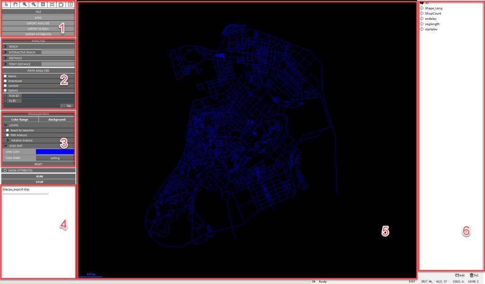

<p align="center">
  
</p>

<h1 align="center">UrConnect</h1>

<p align="center">
  面向城市街道网络的空间组构分析工具，基于 depthmapX，并扩展可达量、转向距离、加权可达性和路径分析工作流。
</p>

<p align="center">
  <a href="https://github.com/intelligibleCityLab/UrConnect/actions/workflows/docs.yml"></a>
  <a href="LICENSE"></a>
  
  
</p>

<p align="center">
  <a href="README.md">English</a> |
  <a href="README.zh-TW.md">繁體中文</a> |
  <a href="docs/source/zh-CN/installation.md">安装</a> |
  <a href="docs/source/zh-CN/getting-started.md">快速开始</a> |
  <a href="docs/source/zh-CN/user-guide.md">用户指南</a>
</p>

## 简介

UrConnect 是一个面向线段化街道网络的桌面分析工具。它将拓扑距离、米制距离和街道属性数据结合起来，可用于城市形态、街道网络、POI、人口、建筑面积等多源数据分析。

主要能力包括：

- 米制、转向、交叉口和组合可达量分析
- 针对所选线段的交互式可达量分析
- 转向距离、交叉口距离和点距离分析
- 手工 OD 或 OD 矩阵的最短路径模拟
- 色谱可视化、屏幕导出、属性导出和 Shapefile 结果写入

## 文档

文档采用类似 OSMnx 的 ReadTheDocs/Sphinx 风格，包含英文、简体中文和繁体中文三个入口：

- [英文文档](docs/source/en/installation.md)
- [简体中文文档](docs/source/zh-CN/installation.md)
- [繁体中文文档](docs/source/zh-TW/installation.md)

本地构建文档：

```bash
python3 -m pip install -r docs/requirements.txt
sphinx-build -b html docs/source docs/_build/html
```

## 安装与构建

项目计划通过 GitHub Releases 提供 Windows、macOS 和 Linux 编译包。Windows/MSVC 是历史上最成熟路径；macOS 已经在本机用 Homebrew Qt 5 和 Boost 通过 Release 构建；Linux 在 CI 完全稳定前作为预览目标。

源码构建示例：

```bash
cmake -S . -B build -DQT5_ROOT=/path/to/Qt/5.15 -DBOOST_ROOT=/path/to/boost
cmake --build build --config Release
```

更多平台命令见 [安装文档](docs/source/zh-CN/installation.md)。

## 许可证

UrConnect 使用 GNU General Public License v3.0 or later。由于项目派生自带 GPLv3-or-later 声明的 depthmapX/sala 组件，这是当前最稳妥的许可证选择。第三方组件说明见 [THIRD_PARTY_NOTICES.md](THIRD_PARTY_NOTICES.md)。
